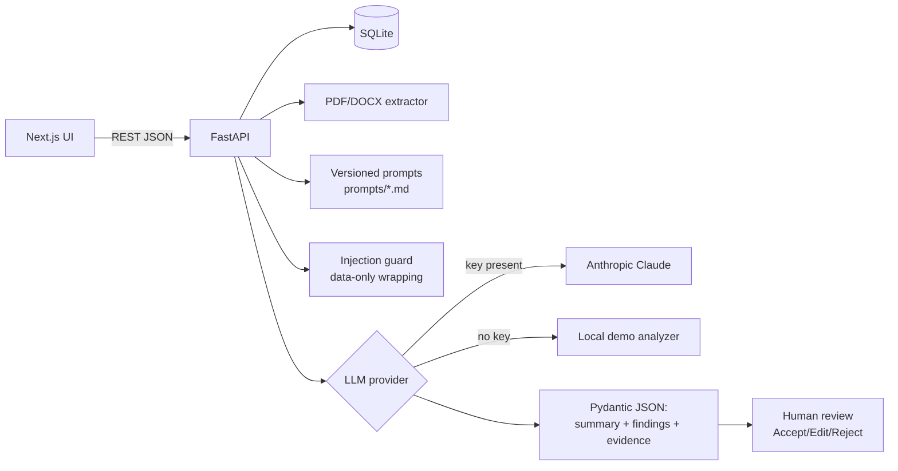

# Document Quality AI Copilot

Web app to consolidate, compare, and validate quality documents with generative AI. Portfolio MVP using **synthetic demo data only** — no real or confidential data.

> AI-generated results must be reviewed before any decision.

## Problem

Quality teams juggle procedures, specifications, and nonconformity reports across versions. Manual cross-checking is slow and misses divergences, missing items, and overdue actions. This MVP shows how Prompt Engineering, Context Engineering, structured output, traceability, human review, and basic AI governance fit together in one demonstrable flow.

## Architecture



## Flow

1. Upload 2–5 PDF/DOCX → text extraction (name, page/section, date) → list.
2. Pick analysis mode + prompt version → system prompt + documents-as-data → provider.
3. Validated JSON (Pydantic): `executive_summary`, `findings[]` (each with evidence), `limitations`. Findings without evidence are withheld.
4. Results table with severity/category filters; evidence excerpt per finding.
5. Human review per finding (Pending/Accepted/Edited/Rejected + comment) with summary counts.
6. History of runs (prompt, model, latency, date) + Governance page.

## Quickstart

```bash
cp .env.example .env            # add ANTHROPIC_API_KEY to use Claude; without it, offline demo runs
docker compose up --build
# UI: http://localhost:3000  API: http://localhost:8000  Health: http://localhost:8000/api/health
```

Local dev:

```bash
cd backend && pip install -r requirements.txt && python -m app.seed && uvicorn app.main:app --reload
cd frontend && npm install && npm run dev
```

## AI provider setup

Pick the provider per analysis run in the UI, or set `LLM_PROVIDER` in `.env`. `auto` uses the first configured provider (Anthropic → OpenAI → Gemini → compat), otherwise the offline demo. Every run records provider, model, and latency. Without any key the offline demo provider runs automatically.

| Provider | Env vars | Default model |
| --- | --- | --- |
| `anthropic` — Anthropic Claude | `ANTHROPIC_API_KEY`, `ANTHROPIC_MODEL` | claude-3-5-sonnet-20240620 |
| `openai` — OpenAI GPT / Codex models | `OPENAI_API_KEY`, `OPENAI_MODEL` | gpt-4o-mini |
| `gemini` — Google Gemini | `GEMINI_API_KEY` (or `GOOGLE_API_KEY`), `GEMINI_MODEL` | gemini-2.0-flash |
| `compat` — OpenAI-compatible endpoint (OpenCode gateway, OpenRouter, Ollama, vLLM) | `COMPAT_BASE_URL`, `COMPAT_MODEL`, `COMPAT_API_KEY` (use any non-empty value for keyless local servers) | — |
| `local` — offline demo, no key | — | local-demo-v1 |

1. Copy `.env.example` to `.env` and fill the keys you want (never commit `.env`).
2. Restart the backend. Check configured providers at `GET /api/providers`.
3. The compat provider retries without strict JSON mode for servers that don't support it (e.g. plain Ollama); results are still validated against the Pydantic schema.

## Analysis modes

Executive Summary · Document/Version Comparison · Missing Items · Divergences & Inconsistencies · Risks & Nonconformities · Suggested Action Plan

## How this demonstrates the skills

- **Prompt Engineering:** versioned system prompts in `prompts/*.md` (answer-only-from-documents, cite source/page, declare uncertainty, never invent, strict JSON, injection resistance); prompt version selectable in UI and stored per run.
- **Context Engineering:** documents wrapped as delimited DATA with section labels; clipping limits; injection scan with flag + log note; system prompt immune to document text.
- **Governance:** Governance page (human validation required, allowed/prohibited data, AI limits) + persistent banner + `/api/governance`.
- **Human review:** per-finding status, reviewer comment, field edits, aggregate counts.

## Evaluation

```bash
cd backend && pip install -r requirements.txt
python evaluation/run_evaluation.py --output evaluation/report.md
```

Scores: citation presence, JSON adherence, findings without evidence (must be 0), latency, cost estimate (local = $0). See `evaluation/questions.json`.

## Tests

```bash
cd backend && pip install -r requirements.txt && pytest -q
```

## Screenshots

- `docs/screenshots/dashboard.png` — placeholder
- `docs/screenshots/results.png` — placeholder
- `docs/screenshots/review.png` — placeholder

## Known limitations

- No OCR (scanned PDFs return a friendly error); 15 MB / PDF-DOCX-only validation.
- SQLite local; no multi-user auth in MVP.
- Offline demo provider is heuristic; real depth requires an Anthropic key.
- Full document content is never logged; API keys never exposed to the frontend.

## Project layout

```
prompts/          versioned system prompts (6 modes)
backend/          FastAPI + SQLAlchemy + Pydantic + providers + tests
frontend/         Next.js + TypeScript + Tailwind (7 screens)
evaluation/       questions + runner + report
```

## License

MIT — synthetic demo data only.
